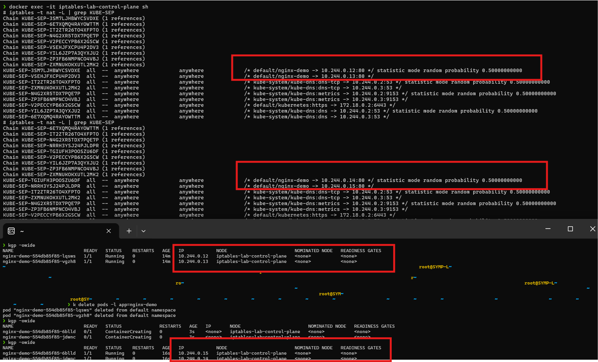

Kubernetes Service → Endpoints → iptables (kube-proxy) Lab
Objective

Understand how Kubernetes Services route traffic to Pods using iptables, and how the rules automatically update when Pods change.

This experiment demonstrates how kube-proxy dynamically updates iptables rules when pod endpoints change.

Lab Environment

Cluster created using kind

Cluster info:

kind get clusters
kubectl get nodes

Example:

NAME                         STATUS   ROLES           AGE
iptables-lab-control-plane   Ready    control-plane
Step 1 — Create Deployment

Create an nginx deployment with 2 replicas.

kubectl create deployment nginx-demo --image=nginx --replicas=2

Check pods:

kubectl get pods -o wide

Example output:

NAME                          READY   STATUS    IP
nginx-demo-xxxxx              1/1     Running   10.244.0.12
nginx-demo-yyyyy              1/1     Running   10.244.0.13

These pod IPs will become service endpoints.

Step 2 — Create Service

Expose the deployment as a service.

kubectl expose deployment nginx-demo --port=80

Check service:

kubectl get svc

Example:

NAME         TYPE        CLUSTER-IP
nginx-demo   ClusterIP   10.96.239.59

Service now routes traffic to the nginx pods.

Step 3 — Observe iptables Rules

Enter the node container.

docker exec -it iptables-lab-control-plane sh

Check iptables rules:

iptables -t nat -L | grep KUBE-SEP

Example output:

/* default/nginx-demo -> 10.244.0.12:80 */
statistic mode random probability 0.50000000000

/* default/nginx-demo -> 10.244.0.13:80 */

Meaning:

Service nginx-demo forwards traffic to two backend pods.

Service
  ↓
10.244.0.12:80
10.244.0.13:80

The probability rule means load balancing.

50% → Pod1
50% → Pod2
Step 4 — Delete Pods

Delete all pods:

kubectl delete pods -l app=nginx-demo

New pods will automatically be created by the deployment.

Check pods again:

kubectl get pods -o wide

Example:

NAME                          READY   STATUS    IP
nginx-demo-aaaaa              1/1     Running   10.244.0.14
nginx-demo-bbbbb              1/1     Running   10.244.0.15

Pod IPs changed.

Step 5 — Observe iptables Change

Check iptables again:

iptables -t nat -L | grep KUBE-SEP

Now output becomes:

/* default/nginx-demo -> 10.244.0.14:80 */
statistic mode random probability 0.50000000000

/* default/nginx-demo -> 10.244.0.15:80 */

Old pod IPs were removed automatically.

Screenshot Evidence

Below screenshot shows how iptables rules changed after pod recreation.

Initial backend pods: 10.244.0.12 and 10.244.0.13

After deletion: 10.244.0.14 and 10.244.0.15

(replace with your screenshot path in repo)

What Happened Internally

When pods change, Kubernetes updates networking automatically.

Flow:

Pod Created / Deleted
        ↓
Endpoint Controller updates Endpoints
        ↓
API Server updates resource
        ↓
kube-proxy detects change
        ↓
kube-proxy rewrites iptables rules
Actual Traffic Flow

Packet routing happens like this:

Client Pod
   ↓
Service IP
   ↓
iptables rule match
   ↓
DNAT rewrite
   ↓
Backend Pod IP

Example:

SRC: pod-ip
DST: service-ip

After iptables rewrite:

SRC: pod-ip
DST: backend-pod-ip

This is DNAT (Destination NAT).

iptables Chain Flow

Actual chain traversal:

Client
  ↓
KUBE-SERVICES
  ↓
KUBE-SVC-XXXX
  ↓
Load balancing rule
  ↓
KUBE-SEP-XXXX
  ↓
Pod IP
Why Random Probability Appears

Example rule:

statistic mode random probability 0.50000000000

Meaning:

50% traffic → Pod A
50% traffic → Pod B

This is how iptables performs load balancing.

Production Scenario Simulated

This lab simulated a real production situation.

Pod crash
   ↓
Endpoint removed
   ↓
kube-proxy updates iptables
   ↓
Traffic redirected to healthy pods

Users do not experience downtime.

This is Kubernetes self-healing networking.

Useful Debug Commands

Check endpoints:

kubectl get endpoints nginx-demo

Check EndpointSlices:

kubectl get endpointslices

Check kube-proxy logs:

kubectl logs -n kube-system -l k8s-app=kube-proxy

Check service iptables rules:

iptables-save | grep nginx-demo
Important Production Insight

iptables works well for small clusters.

But large clusters may have:

10,000 services
50,000 pods

iptables rules become very large.

Many organizations now use **Cilium instead of kube-proxy.

Instead of iptables:

Service
  ↓
eBPF map lookup
  ↓
Pod

This provides faster networking.

Final Learning

Kubernetes networking works as follows:

Pods created
     ↓
Endpoint Controller updates endpoints
     ↓
kube-proxy watches API server
     ↓
kube-proxy updates iptables rules
     ↓
Service traffic routed to pods

===============================================================================================================================================
PROBLEM STATEMENT:

A temporary client/debug pod is created using kubectl run to act as a test client inside the cluster.
From this pod we can send requests (using tools like wget, curl, or ping) to a Kubernetes Service in order to observe how traffic is routed through the cluster networking components (Service → kube-proxy → iptables → backend Pods).

Kubernetes Debugging & Workload Commands
1️⃣ Create Deployment

Create an application workload managed by Kubernetes.

kubectl create deployment nginx-demo --image=nginx --replicas=2
What it does

Creates the following resources:

Deployment
   ↓
ReplicaSet
   ↓
Pods
Use Case

Used when you want Kubernetes to manage application pods automatically.

Features:

Self-healing (pods recreated if deleted)

Scaling support

Rolling updates

Example use cases:

Running microservices

Web servers

Backend APIs

2️⃣ kubectl run

Create a temporary pod quickly.

kubectl run test --image=busybox -it --rm -- sh
What it does
kubectl run
     ↓
Creates temporary pod
     ↓
Opens shell
     ↓
Pod deleted when exiting
Use Case

Mainly used for debugging and testing inside the cluster.

Common tasks:

Testing service connectivity

DNS lookup

Sending HTTP requests

Example:

wget nginx-demo
ping pod-ip
nslookup service-name
3️⃣ kubectl exec

Run commands inside an existing pod.

kubectl exec -it <pod-name> -- sh
What it does
User
  ↓
kubectl exec
  ↓
Shell inside running container
Use Case

Used when you need to:

Debug application issues

Inspect container filesystem

Run diagnostic commands

Example:

kubectl exec -it nginx-demo-abc123 -- sh
4️⃣ wget Use Case

Used to send HTTP requests to services or pods.

Example:

wget -qO- nginx-demo

Explanation:

wget      → HTTP client
-q        → quiet mode
-O-       → print output to terminal
nginx-demo → Kubernetes service name
Use Case

Used to verify:

Service routing

Load balancing

Application response

Example flow:

Client Pod
   ↓
Service IP
   ↓
kube-proxy (iptables)
   ↓
Backend Pod
5️⃣ ping Use Case

Used to check network connectivity between pods or nodes.

Example:

ping 10.244.0.5
Use Case

Used to test:

Pod-to-pod connectivity

CNI network functionality

Basic cluster networking

Example flow:

Pod A
   ↓
CNI network
   ↓
Pod B
Typical Kubernetes Networking Debug Flow
kubectl run test --image=busybox -it --rm -- sh
        ↓
inside test pod
        ↓
ping pod-ip
wget service-name
        ↓
verify networking and service routing
Quick Command Summary
Command	Purpose
kubectl create deployment	Create managed application workload
kubectl run	Create temporary debug pod
kubectl exec	Run commands inside running container
wget	Test HTTP connectivity to services
ping	Test network connectivity between pods